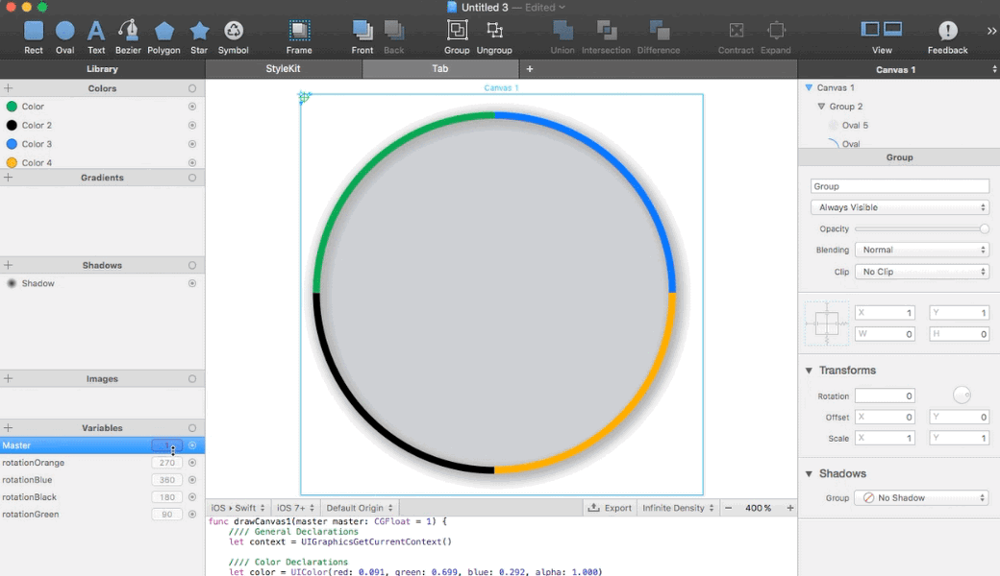
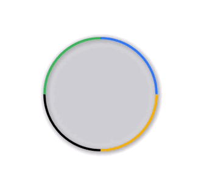

# LoadingLikeABoss

Learn how to create a simple loading animation, using PaintCode, Xcode 7.x and Swift 2.0

## Usage

Take a look at the project to see a full example.

## Requirements

* iOS 8 or later
* Xcode 6 or later

## Author
Razvigor Andreev - helpMeCodeSwift @ Twitter
http://helpMeCodeSwift.com

## License

LoadingLikeABoss is available under the MIT license. See the [LICENSE](https://github.com/ravenshore/LoadingLikeABoss/blob/master/LICENSE.md) file for more info.